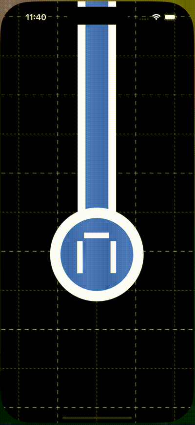

# TravelSchedule App

## Overview
An app for searching train trips and schedules.

## Features
- Search for train trips
- Filter by time or transfer
- Watch stories (Beta)
- Dark theme support

## Tech Stack
- **Language:** Swift
- **Architecture:** MVVM
- **Frameworks & Libraries:** SwiftUI, Swift Open API Generator, Combine, UIKit
- **Tools:** Swagger

## Installation
```bash
git clone https://github.com/BVladimir01/TravelSchedule
cd TravelSchedule
open TravelSchedule.xcodeproj
```

### Requirements
- Swift 5.x
- iOS 17+
- Xcode 16+

## Preview

| Trip selection | Settings | Stories |
|:--------------:|:--------:|:-------:|
|  |  |  |

##  Project Structure

**TravelSchedule/** \
├ **TabSelectionView/** *# Main tab view* \
├ **SettingsFlow/** *# Settings tab* \
├ **ScheduleSelectionFlow/** *# Schedule search tab* \
├ **ReusableViews/** *# Reusable UI Components* \
├ **Services/** *# Network and decoding services* \
└ **Resources/** *# Images, OPEN API config*

## Future plan
- [ ] Improve project srtucture 
- [ ] Add localization
- [ ] Add transitions for stories
- [ ] Add Unit tests
- [ ] Add UI tests
- [ ] Add documentation

## Acknowledgements
Big thanks to Yandex Practicum reviewers.
